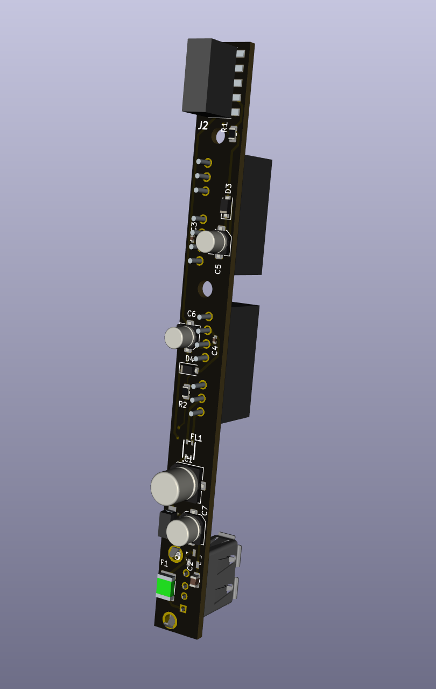

# USBPowerSupply

USB Power supply design for eurorack

- 2 HP
- 500mA at +12v, 500mA at - 12v
- efficient isolated DC-DC switching regulator with low heat release
- surge voltage and over-current protection with resettable fuse
- reversed polarity protection
- common mode choke and multiple ferrite beads with PI filter for noise filtering
- 1 LED per rail to indicated overload and short circuits

Warning and reserved:
- the two DC-DC switching regulators are expensive compared to the rest of the components: they represent about 75% of the total cost
- the minimum voltage allowed is 4.5v, which we know can be too low for USB chargers as soon as the current rises above 0.5A, there is a need to test chargers and advise specific ones. with power banks they should be no problems as their output is regulated
